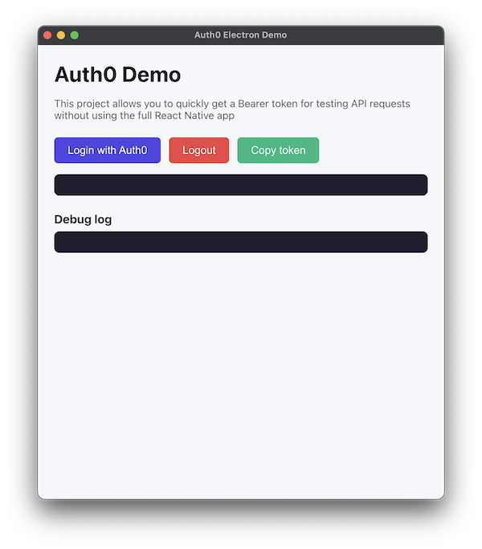

# Auth0 Electron Demo

This small Electron app emulates the Auth0 login flow used by a React Native app and displays the resulting Bearer token. It's useful for testing API endpoints without running the full mobile application.

## Features
- PKCE-based Authorization Code flow with Auth0
- Displays a ready-to-copy `Bearer <access_token>` string
- Basic logout that clears Auth0 cookies in the Electron session
- Minimal and secure bridge between renderer and main via `preload`  
- Cross-platform packaging (macOS DMG, Windows Portable) via `electron-builder`  

## Screenshots
The UI is intentionally simple: buttons for Login, Logout, Copy token, a status label, and a debug log area.
 

## Requirements
- Node.js 18+
- Yarn or npm  
- Auth0 tenant with:
  - Application (Native or SPA)  
  - Allowed Callback URLs containing your redirect URI

## Configuration
The app reads settings from an external `config.json` file.

- **Development:** place `config.json` in the project root.  
- **Production:** see the section below for standard locations.

`config.json` and other local config files are ignored by Git. Use `config.example.json` as a template and do not commit real secrets.

### Required/Optional keys
- `AUTH0_DOMAIN`: your Auth0 domain (e.g., `your-tenant.eu.auth0.com`)  
- `AUTH0_CLIENT_ID`: your Auth0 application client ID
- `AUTH0_AUDIENCE` (optional): API audience (e.g., `https://api.example.com`)  
- `AUTH0_SCOPE` (optional): requested scopes (default: `openid profile email offline_access`)  
- `AUTH0_REDIRECT_URI`: redirect URI registered in Auth0 (e.g., `com.yourapp.auth0://callback`)  

Create your config from the example:  
```bash
cp config.example.json config.json
# edit values
```

## Development
Install dependencies and start the app:  
```bash
yarn install
yarn start
# or
npm install
npm run start
```

## Packaging (Build)
The project uses `electron-builder` with platform-specific scripts.

**Custom protocol:**  
- The app registers a URI scheme at runtime based on `AUTH0_REDIRECT_URI` (e.g., `com.yourapp.auth0://callback`) so Windows/macOS won’t prompt about unknown apps.  
- Packaged builds include a generic scheme (`com.example.auth0`). Update `package.json > build.protocols` to match your `AUTH0_REDIRECT_URI` if distributing installers.

- **macOS DMG:**  
  ```bash
  yarn dist:mac
  ```
- **Windows Portable:**  
  ```bash
  yarn dist:win
  ```
- **All platforms (CI/OS):**  
  ```bash
  yarn dist:all
  ```

Artifacts are placed in the `dist/` directory.

## Production configuration (after build)
The packaged app reads settings from an external `config.json`, which should be placed next to the app or in standard system locations:

- **macOS DMG / installed app:**  
  - `~/Library/Application Support/Auth0ElectronDemo/config.json` (per user)
  - Inside the app bundle resources folder next to `app.asar` (advanced)
- **Windows portable EXE:**  
  - next to the `.exe`  
  - or `%APPDATA%/Auth0ElectronDemo/config.json`  

Create your file from the example:
```bash
cp config.example.json config.json
# edit values
```

## Security Notes
- Secrets are not hard-coded; provide them via `config.json`. Do not commit secrets.  
- The renderer process has no direct Node.js access; communication is through a minimal preload bridge.  
- Content Security Policy is defined in `index.html`.  

## Code Structure
- `main.js`: main process; window creation, Auth0 flow, token exchange, logout, logging.
- `preload.js`: minimal API (`auth.login`, `auth.logout`, `auth.onLog`).  
- `renderer.js`: UI handlers and log rendering.
- `index.html`: simple UI with buttons and log area.  

## License
MIT. See [LICENSE](./LICENSE).
